# NestStay

做毕业设计的时候，民宿这个题其实挺好写的：有前台给游客订房，有后台给商家和管理员办事，论文里也好画用例图。NestStay 就是按这个思路做完的一套民宿预订系统——订房、入住、退款、客服、社区和资讯走同一套数据，首页推荐吃的是真实业务表，而不是单独造一份演示数据集。

选题上刻意做成**可运营、可解释**的质量感知推荐，而不是黑盒打分：平台指数把评分和履约写进排序，管理员能锁定精选；推荐侧是召回加排序的混合方法（内容相似 + 用户协同过滤 + 热门与指数），冷启动走精选和热门。数据规模按课程作业来，所以没有上深度模型，保证本地能跑、论文能画图、答辩能讲清权重从哪来。

## 创新点

1. **质量感知的民宿排序**  
   平台指数把住客评分、评价量、履约、商家响应和热度写进同一套分，热门不再只看 `click_count`。指数达标才建议精选，管理员锁定后规则不再改绿标——推荐结果能运营、能解释，而不是黑盒打分。

2. **召回–排序两段式混合推荐**  
   候选按同城、类型、价位、精选、协同邻居收缩；排序融合用户偏好、基于内容的相似度、基于用户的协同过滤（收藏 Jaccard）和热门分。冷启动走精选与热门，重复点击略降权。方法都是经典组合，贡献在民宿特征怎么进权、冷启动怎么兜底。

3. **推荐与后台漏斗打通**  
   曝光、点击、收藏、下单进 `recommend_event`。管理端按窗口看 CTR、收藏率、成单率，对比精选 / 非精选和上一周期。用来调权和写实验，明确不是随机 A/B。

4. **订房之后的履约闭环**  
   下单、支付、确认入住、签退、评价、退款协商到平台介入，和推荐用的履约、评分是同一批表。推荐吃真实订单，不是单独造一份演示数据。

5. **分层客服：知识库 → 可选模型 → 转人工**  
   小搏先检索知识库和话术；未命中可走管理员配置的兼容 OpenAI 通道；用户说「转人工」进平台会话队列。失败只留原话、不乱转人工，密钥不回传明文。

6. **个人主页把社交和行程收在一处**  
   封面、发帖、资讯、收藏、隐私开关面向访客；订单、入住看板、申诉、消息面向本人。论坛和资讯作者申请从主页进去，避免「个人中心只有改密」。

7. **社区等级与资讯作者审核**  
   论坛按话题节点、等级门槛、置顶热门组织；资讯走分类频道和作者申请（凭证审核后发文）。内容和预订账号打通，方便写用例图和权限说明。

8. **消费者 / 商家 / 管理员三套会话**  
   Token 与角色菜单分开，工作台待审房源、退款、帖子、未回客服集中展示。论文里的参与者和后台功能能对上页面，而不是只有一张 ER 图。

写论文时建议：**1～3 作推荐与评估主创新**，**4～5 作业务与智能客服**，**6～8 作产品与权限完整性**。学校只要三点，优先保留 1、2、5（或 1、2、4）。

## 界面一览

首页会把精选和热门房源摊开，轮播、搜索、论坛和资讯入口都在上面：

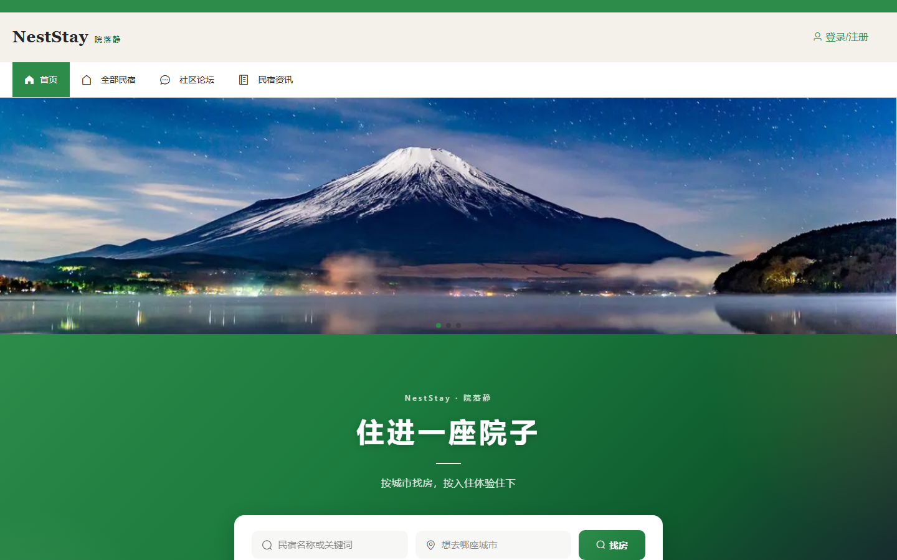

民宿列表支持按城市、类型、价格筛，卡片上有图、价、标签：

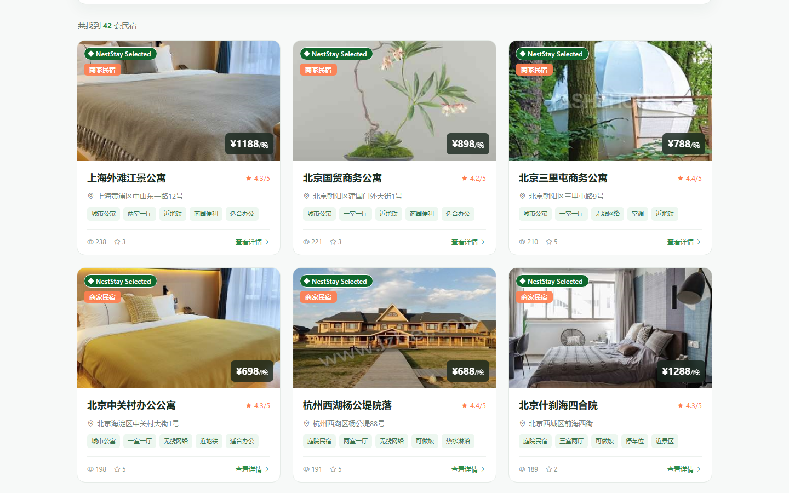

点进详情能看相册、介绍、位置和商家信息，登录之后可以从这里下单：

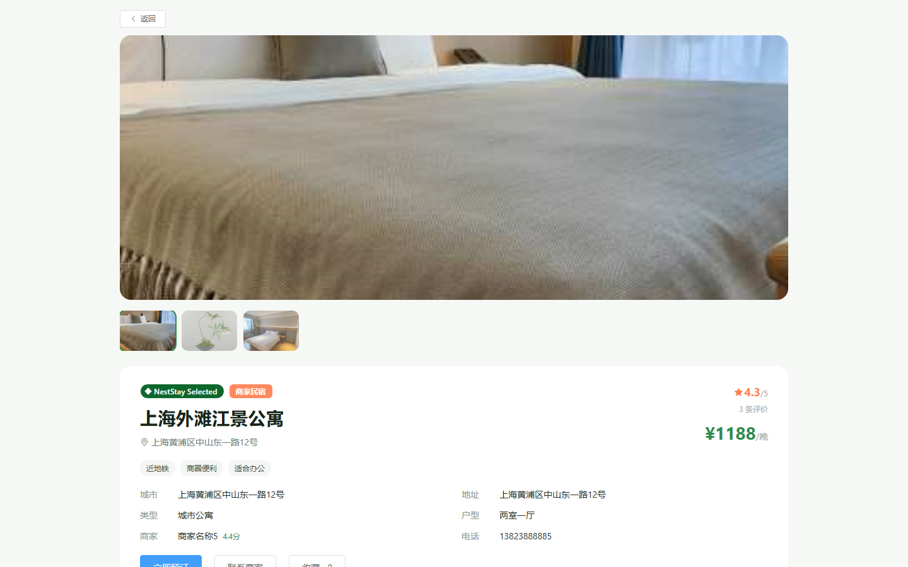

社区论坛用来发游记、提问，资讯频道放攻略和平台公告：

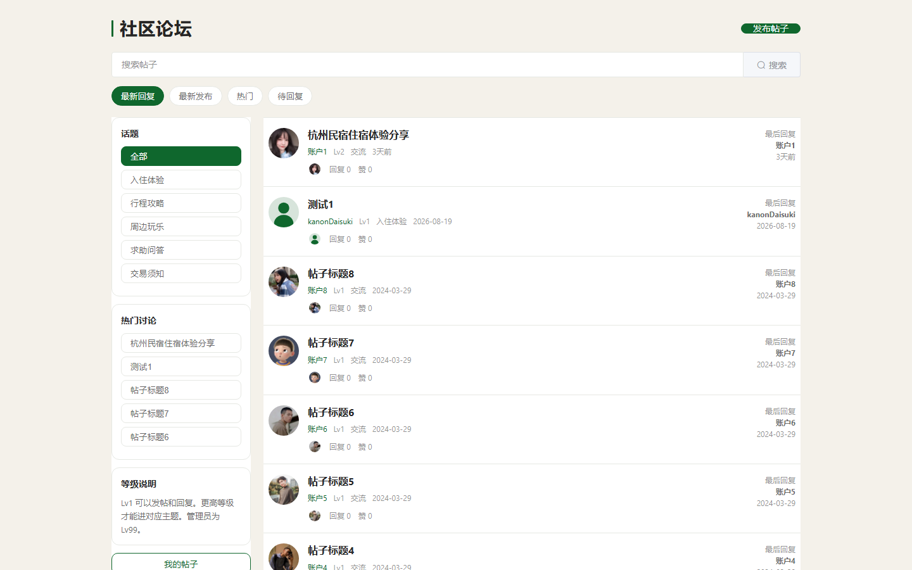

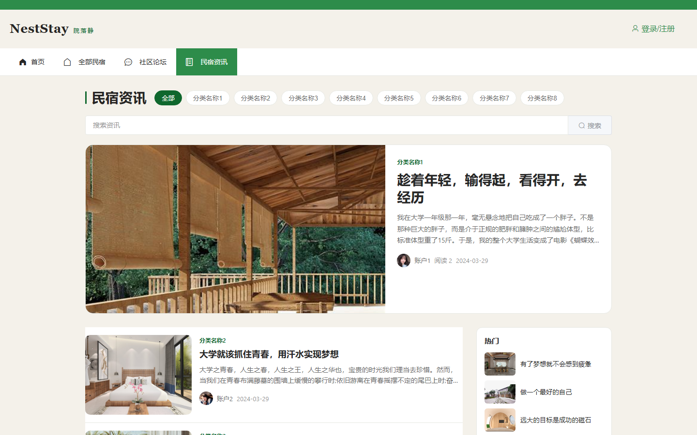

消费者登录页：

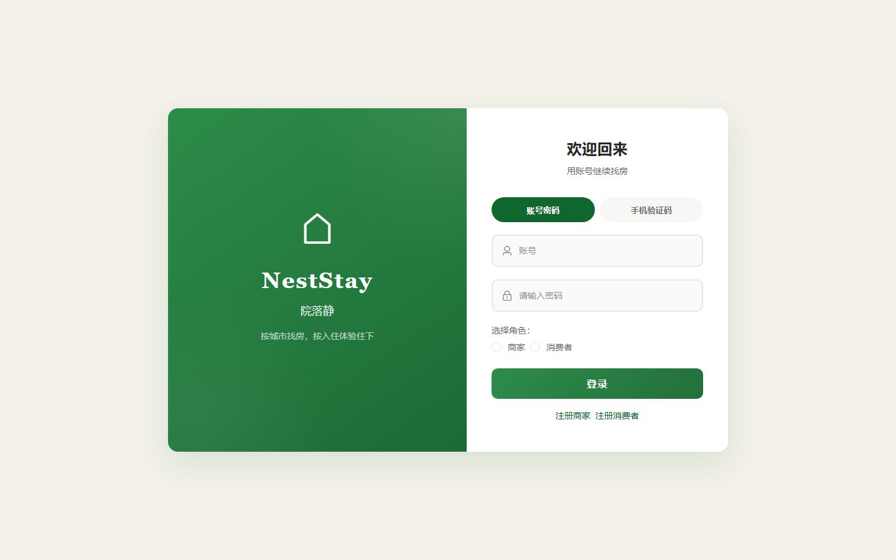

登录后可以和商家或平台客服聊天，知识库没命中时会转到人工：

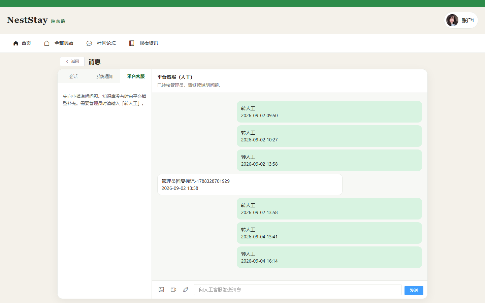

管理端登录页，管理员和商家分开进：

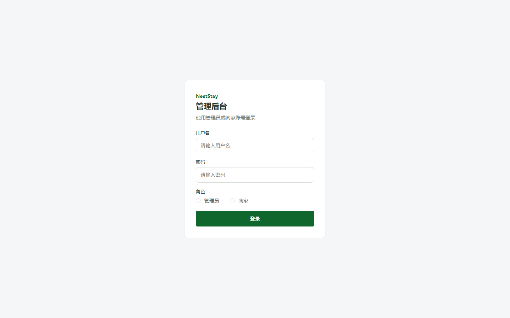

进去是工作台，待审房源、退款、帖子这些数字会摊在上面：

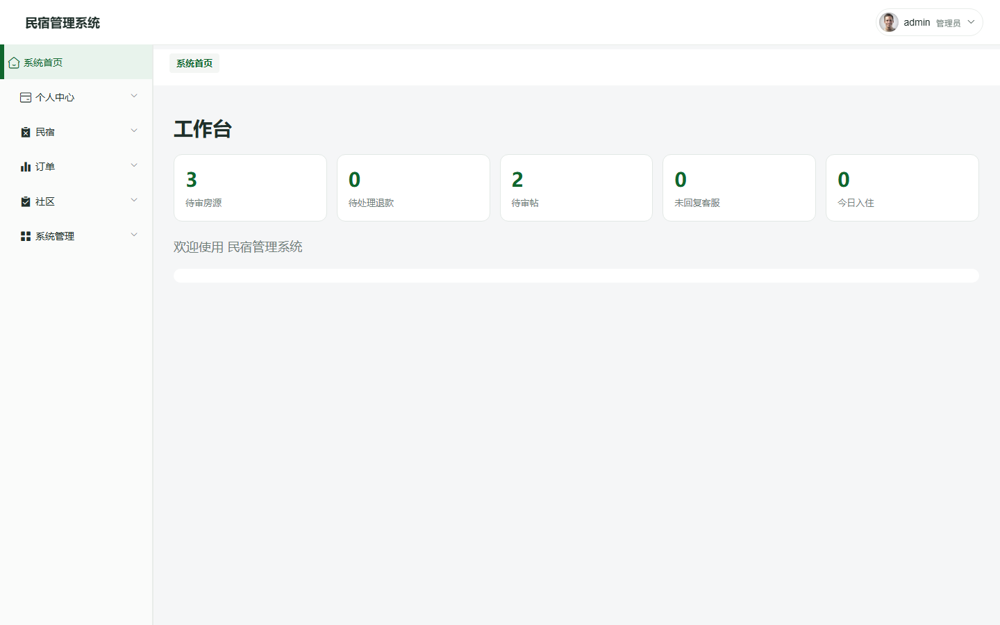

平台客服会话能从后台跟进：

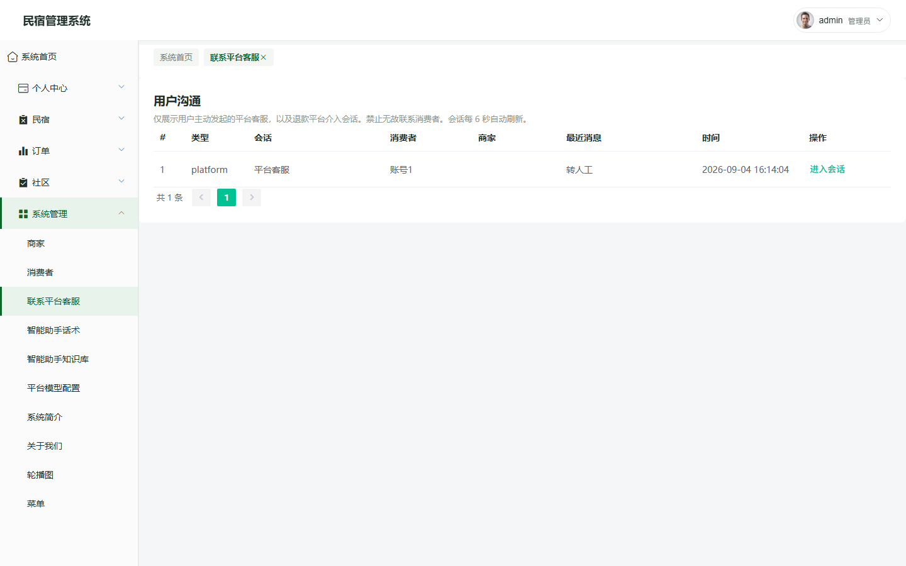

民宿信息列表带筛选和分页：

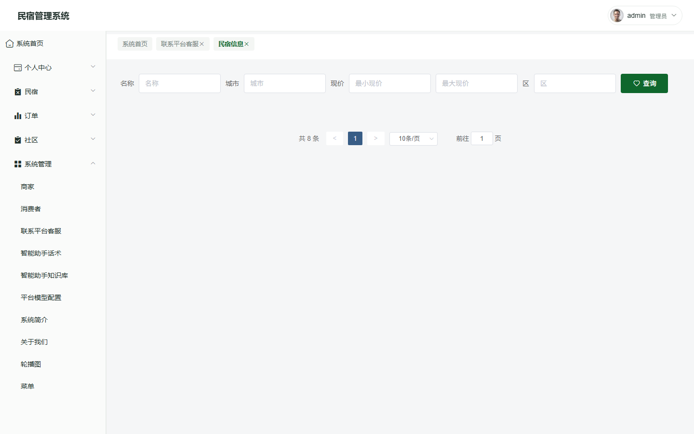

## 系统怎么拆

NestStay 是典型的前后端分离：浏览器里跑两个 Vue 2 单页（消费者、管理端），REST 接口由 Spring Boot 提供，MySQL 存业务数据。开发时前端各自开 Vite 热更新（8082 / 8081），打包后静态资源挂到 `/neststay/front` 和 `/neststay/admin`，和后端共用一个 8080 端口。

```text
┌─────────────┐     ┌─────────────┐
│  消费者 SPA  │     │  管理端 SPA  │
│  Vue + Vite │     │ Element UI  │
└──────┬──────┘     └──────┬──────┘
       │    HTTP / JSON    │
       └─────────┬─────────┘
                 ▼
        ┌────────────────┐
        │ Spring Boot 3  │
        │ Controller     │
        │ Service / DAO  │
        └────────┬───────┘
                 ▼
            MySQL 8
```

后端按常见分层组织：`controller` 对外接口，`service` 业务逻辑，`dao` + `mapper/*.xml` 访问表，`entity` 映射实体。定时任务（如未支付订单超时）在 `task` 包；Token 鉴权走拦截器，管理员、商家、消费者三套会话互不混用。

## 角色与模块

**消费者**

- 浏览 `platform_view` 聚合的民宿目录，搜索、收藏、下单、模拟支付
- 入住期间联系商家，评价、发起退款协商
- 论坛发帖、资讯阅读，消息中心里和商家或平台客服聊天（小搏助手 + 转人工）

**商家**

- 维护自家房源，处理订单与入住看板
- 配置客房附加服务，接待住客 IM 咨询

**管理员**

- 精选房源、推荐漏斗与指数重算
- 订单与退款终审，论坛 / 资讯 / 作者申请审核
- 工单、菜单权限，智能助手知识库与模型通道

## 核心业务流

**订房**：列表曝光 → 详情页 → 选日期下单 → 支付 → 商家确认入住 → 签退 → 评价。

**退款**：住客发起协商 → 商家同意或驳回 → 必要时平台介入 → 管理员终审。

**沟通**：会话按「消费者—商家」或「消费者—平台」区分；小搏先查知识库，未命中可走配置的 LLM，关键词「转人工」进管理员会话队列。

## 民宿推荐

民宿不能只按点击量排。热门刷榜会把履约差、响应慢的房顶上去，冷门好房又出不来。NestStay 做成**召回–排序两段式混合推荐**：先把候选缩到大约 200 条，再把用户偏好、房源相似度和平台质量分融在一起。实现上对应三类经典方法，外加一层业务规则，论文里可以分别画成内容推荐、协同过滤和流行度推荐，再写一节线性加权融合。

**平台指数（质量约束）**  
管理员可全量重算。单房指数五维加权：住客评分 45%、评价量 15%、履约率 20%、商家响应 10%、热度 10%。指数 ≥ 70 且评价 ≥ 3 条会进入「建议精选」；管理员打标后锁定，规则不再改该房绿标。排序里指数权重大于纯点击，用来压热门偏差。

**召回**  
已发布房源里按同城、同类型、价位接近、精选、新鲜度、协同过滤邻居收候选。收藏与订单（以及近期点击）用来推断城市、品类、价位和标签；没有历史时视为冷启动，候选向热门和精选倾斜。

**排序（加权混合）**  
个性化打分大致是：偏好匹配 0.34、平台指数 0.22、基于内容的相似度 0.14、基于用户的协同过滤（收藏集合 Jaccard）0.10、热门分 0.12，再加新鲜度、精选加成和点击微调。点过两次的同一套房会略降权，避免首页反复推同一条。详情页「相似民宿」是内容相似为主（城市、类型、价位、标签），再乘指数和新鲜度。

**离线评估**  
曝光、点击、收藏、下单写入 `recommend_event`。管理端按时间窗口算 CTR、收藏率、成单率，并对比精选与非精选、对比上一同等窗口。这是漏斗观察，用来调权和写实验小节，不是随机分流的在线 A/B。

```text
收藏 / 订单 / 点击 → 用户偏好
评分 / 履约 / 响应 / 热度 → platform_index
        ↓
召回（内容规则 + 协同邻居 + 热门补足）
        ↓
加权排序 → 首页精选 / 热门 / 个性化
        ↓
recommend_event 漏斗（曝光→点击→收藏/下单）
```

写论文时建议把贡献写成「民宿场景下的质量感知混合推荐 + 可运营精选 + 离线漏斗」，不要写成提出了新的深度学习算法。数据量按毕设规模，深度模型既跑不稳也难答辩。

## 个人主页

消费者登录后进入 `/index/center`，页面按社交主页布局组织，而不只是「账户设置」。

**主页展示**：可自定义封面（图或短视频）、头像、昵称与简介；对外展示发帖数、文章数、收藏数。访客从论坛或资讯点头像也能跳进他人主页，受隐私开关控制。

**内容 Tab**：「发布」下分论坛帖与资讯文章；「收藏」展示收藏的民宿；「关于」补充简介、加入时间与论坛等级 Lv。

**行程相关**（仅本人）：订单列表、入住状态看板、申诉工单，与顶栏「消息」入口并列，不必散落在多个菜单里。

**账户侧栏**：公开资料、实名与手机（短信验证后修改）、改密、暗黑模式；隐私里可分别隐藏发帖、发文、收藏。商家账号同一套壳子，换成商家名称、地址、电话等字段。

## 社区论坛

论坛是独立频道 `/index/forum`，面向游记、提问和同城交流。

**浏览**：按话题节点筛选（侧边栏），支持标题搜索；排序可切换最新 / 最热。列表展示作者等级 Lv、置顶与热门标记，以及最近参与讨论的用户头像。

**发帖与互动**：发帖需登录；详情页支持树形评论、点赞。等级 Lv1 可发可回，部分主题对等级有门槛，管理员为 Lv99。

**我的帖子**：`/index/myForumList` 汇总本人发帖；个人主页「发布 · 论坛」Tab 与论坛列表互通。

**管理端**：帖子审核、置顶、回复状态在工作台待办里也会计数。

## 民宿资讯

资讯频道 `/index/news` 偏攻略与平台公告，版式接近轻量内容站。

**频道页**：顶部分类 Tab（攻略、公告等，来自 `news_type`），首条大图封面 Story，下方卡片流带作者头像、阅读数与时间。

**阅读与创作**：详情页正文 + 评论；消费者可在个人主页申请成为资讯作者（提交平台与粉丝凭证），通过后从主页「发表文章」进入编辑器。

**管理端**：文章、分类、作者申请、评论分别在对应菜单审核；与消费者端展示字段对齐。

## 答辩时可以怎么讲

NestStay 的完整度在三端闭环，推荐只是首页入口。口头大约半分钟：

民宿推荐不能只按点击。做成召回加排序：先按城市、类型、价位和协同过滤缩候选，再把用户偏好、房源相似度和平台指数融在一起。指数里评分和履约权重大，避免热门刷榜。后台用曝光、点击、收藏、下单做漏斗，对比精选和非精选，方便调权。数据量不大，所以没用深度模型，保证可复现、权重可解释。

客服可以顺带一句：小搏先查知识库，未命中再走配置的模型通道，用户说「转人工」进管理员会话——和推荐一样，都是能画进论文的业务链路，而不是演示页上的按钮。

## 数据要点

| 表 / 概念 | 用途 |
|-----------|------|
| `platform_view` | 消费者侧主列表，商家房源与平台精选的统一视图 |
| `homestay_info` | 民宿基础信息，管理端维护 |
| `homestay_rental` | 订单，含 `source_type` 关联数据来源 |
| `conversation` / 消息表 | IM 会话，区分 platform / merchant |
| `assistant_knowledge` | 小搏知识条目 |
| `llm_channel` | 模型通道与助手模式 |
| `support_ticket` | 申诉工单 |
| `recommend_event` | 推荐行为埋点 |
| `forum_post` | 社区帖子与评论 |
| `news_article` / `news_author` | 资讯文章与作者申请 |

库名 `neststay_demo`，建表与种子数据见 `db/` 目录。

## 仓库结构

```text
NestStay-Shell/
├── db/                    # 数据库初始化脚本
├── docs/                  # 文档与 README 配图
├── scripts/               # 从完整前端重新打 dist（PowerShell）
├── src/main/java/         # Spring Boot 后端
├── src/main/resources/
│   ├── application.yml    # 端口、数据源等配置
│   ├── front/front/dist/  # 消费者前端
│   └── admin/admin/dist/  # 管理端前端
├── initiate_service.bat   # Windows 一键启动
├── initiate_service.sh    # macOS / Linux 启动
├── gradlew.bat
```

## 本地运行

环境：Java 21、MySQL 8。数据库账号默认 `root` / `123456`。仓库里已经带好前后端 dist，日常只需建库再启动后端。

**Windows**

```bat
db\init_demo.bat
gradlew.bat bootRun
```

或 `initiate_service.bat`。

**macOS / Linux**

```bash
bash db/init_demo.sh
chmod +x gradlew initiate_service.sh
./gradlew bootRun
```

或 `./initiate_service.sh`。浏览器打开：

- 消费者 http://localhost:8080/neststay/front/index.html#/index/home
- 管理端 http://localhost:8080/neststay/admin/admin/dist/index.html#/login

演示账号：消费者 `账号1` / `123456`，管理端 `admin` / `admin`。

---

了解更多或交流请联系，务必说明来意：
邮箱 [lxd28116@outlook.com](mailto:lxd28116@outlook.com) · QQ 3359756961
