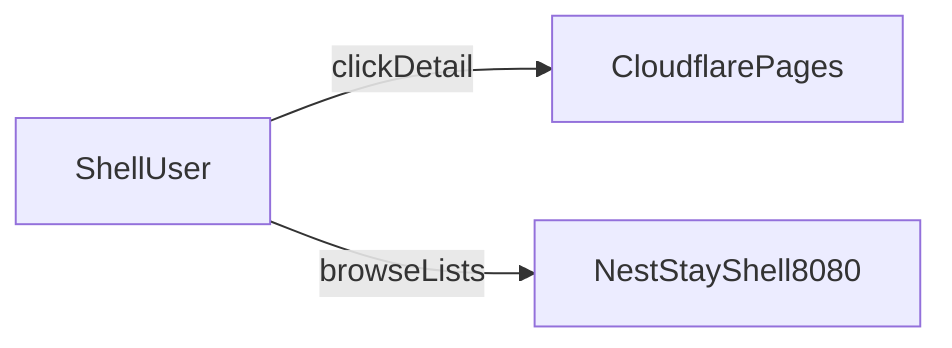

# Cloudflare Pages 联系页部署教程

将 NestStay 预览壳的「联系作者」外链部署到 Cloudflare Pages（免费）。

## 前置条件

- 一个 Cloudflare 账号（[注册](https://dash.cloudflare.com/sign-up)）
- 本地已有 [`docs/contact-page/index.html`](contact-page/index.html)

## 步骤 1：登录 Cloudflare

打开 [Cloudflare Dashboard](https://dash.cloudflare.com/) 并登录。

## 步骤 2：创建 Pages 项目

1. 左侧菜单选择 **Workers & Pages**
2. 点击 **Create**
3. 选择 **Pages** → **Upload assets**（Direct Upload，最简单）
4. 项目名称例如：`neststay-contact`
5. 将 `docs/contact-page` 文件夹中的文件拖入上传区（至少包含 `index.html`）
6. 点击 **Deploy site**

部署完成后会得到地址，例如：

```text
https://neststay-contact.g1gsmax.sbs
```

## 步骤 3：验证联系页

浏览器打开 `https://neststay-contact.g1gsmax.sbs`，确认占位文案显示正常。

## 步骤 4：写入 NestStay-Shell 配置

1. 编辑 [`src/main/resources/application.yml`](../src/main/resources/application.yml)：

```yaml
shell:
  contact-url: "https://neststay-contact.g1gsmax.sbs"
```

2. 编辑 [`shell-patches/shell-config.json`](../shell-patches/shell-config.json)：

```json
{
  "contactUrl": "https://neststay-contact.g1gsmax.sbs"
}
```

3. 重新构建前端补丁：

```powershell
powershell -ExecutionPolicy Bypass -File scripts\build-shell-frontends.ps1
```

4. 重启后端或运行 `initiate_service.bat build`

## 步骤 5：更新联系页内容（后续）

只需在 Cloudflare Pages 项目中 **重新上传** 更新后的 `index.html`，无需改 NestStay 代码（除非更换域名）。

Dashboard → 你的 Pages 项目 → **Upload new version**

## 可选：自定义域名

当前联系页已绑定：`https://neststay-contact.g1gsmax.sbs`。再加域名时，Pages 项目 → **Custom domains**，按提示加 CNAME，并把上面的 `contact-url` / `contactUrl` 改成新地址。

## 常见问题

| 问题 | 处理 |
|------|------|
| 预览壳点击详情没跳转 | 确认已 rebuild 前端 dist，且 `shell-config.json` URL 正确 |
| Pages 部署后 404 | 确保根目录有 `index.html` |
| 国内访问慢 | 可改用 Cloudflare 自定义域名 + 国内 DNS，或备选 Gitee Pages |

## 与预览壳的关系



预览壳只保存外链 URL；联系页内容与样式独立托管在 Cloudflare Pages。
